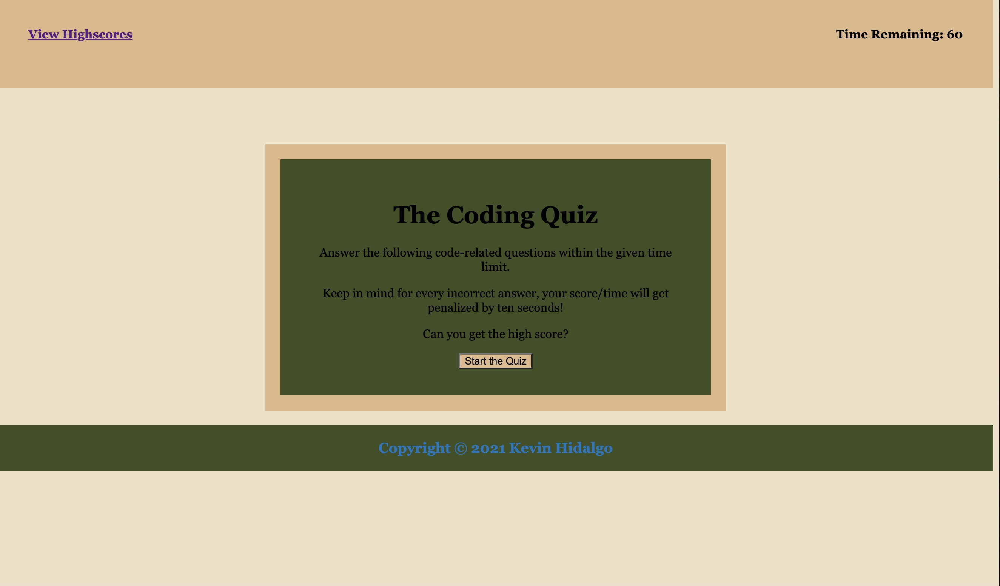

            Homework #4: The Code Quiz

The Homework Task

          For this weeks homework he will complete a task that is seen as essential for an interview process for any web developer and their journey to becoming one. In this Homework #4 we will build a timed coding quiz that includes multiple-choice questions. For this application we will build all the code, including the HTML, CSS and the Javascript. This app has to run through the browser while displaying clean, polished and a responsive user interface. This homework is essential to equip any student with skills needed to succeed in our journey.

The following is the Acceptance Criteria:

GIVEN I am taking a code quiz
WHEN I click the start button
THEN a timer starts and I am presented with a question
WHEN I answer a question
THEN I am presented with another question
WHEN I answer a question incorrectly
THEN time is subtracted from the clock
WHEN all questions are answered or the timer reaches 0
THEN the game is over
WHEN the game is over
THEN I can save my initials and my score

URL to my structured Coding Quiz:

Screenshot of the featured quiz:

THE GRADING RUBRIC TO GETTING THE BEST POSSIBLE GRADE:

This homework is graded based on the following criteria: 

### Technical Acceptance Criteria: 40%

* Satisfies all of the preceding acceptance criteria.

### Deployment: 32%

* Application deployed at live URL.

* Application loads with no errors.

* Application GitHub URL submitted.

* GitHub repository contains application code.

### Application Quality: 15%

* Application user experience is intuitive and easy to navigate.

* Application user interface style is clean and polished.

* Application resembles the mock-up functionality provided in the homework instructions.

### Repository Quality: 13%

* Repository has a unique name.

* Repository follows best practices for file structure and naming conventions.

* Repository follows best practices for class/id naming conventions, indentation, quality comments, etc.

* Repository contains multiple descriptive commit messages.

* Repository contains quality readme file with description, screenshot, and link to deployed application.

## Review

You are required to submit BOTH of the following for review:

* The URL of the functional, deployed application.

* The URL of the GitHub repository, with a unique name and a readme describing the project.

